##1. Summary

_Consensus Clustering_ is a revised tool for implementing the methodology for class discovery and clustering validation, based off of Monti et al, 2003 paper, Consensus Clustering: A Resampling-Based Method for Class Discovery and Visualization of Gene Expression Microarray Data. This method is used to find a consensus assignment across multiple runs of a clustering approach, allowing one to assess and validate the stability of the discovered clusters empirically. The objective of this method is to identify robust clusters in the context of genomic data, but is applicable for any unsupervised learning task.

##2. Description of Consensus Clustering
The development of Consensus Clustering is driven by the need to determine the number of cluster as well as how likely the membership of the clusters repeatably agreed within a dataset. This application is aimed towards genomic data within cancer genomics where subclasses of disease are clinically relevant for treatment but can easily be applied elsewhere. This method includes taking random subsamples of data points, applying a clustering algorithm to cluster the samples into k groups and then calculating some consensus among all the iterations to produce a final and robust cluster assignment. This is done for different values of k, and the Consensus Clustering methodology also provides tools for assesing the optimal number of clusters.

More specifically, Consensus Clustering was inspired by ConsensusClusterPlus (Wilkerson 2010), with major design and application renovation to the implementation which includes but not limited to:

* Implementation of parallelization: Our package let the user take advantage of multiple cores or the power of computational clusters to perform the bootstrap iterations in a faster way.
* Improved use of data structures: In order to have better memory efficiency, we replaced all symmetric consensus matrices between pairs of samples with consensus vectors which store the same data in smaller structures.
* User-friendly source code: Our code was developed following good-practice style, with descriptive variable names and a clear separation of the different tasks. These characteristics, missing in the previous ConsensusClusterPlus package, contribute to maintainability, understandably, reuseability, debugability and extensibility of the code.
* Functions for analysis of the results that can be called later independently of the main function: All the diagnosis plots for assessment of optimal value of K, as well as the calculation of consensus statistics, can be obtained in the main execution of the consensusClustering function but can also be disabled and run individually later calling the respective functions with consensusClustering results as input. This allows the user to choose whether to spend time and computational resources in these tasks or not.
* More flexible options for plots: Heatmaps for big data sets can run into computational problems when they try to plot deep dendrograms or visualization issues when annotating samples and features names. We made these characteristics available to be defined by the user.
*Implementation of PAC scores: Our package adds one extra measure to asses the optimal number of K, the Proportion of Ambiguously Clustering (PAC score, Senbabaoglu, 2014).
* Intra and Inter Cluster Consensus summary: Our package returns single intra and inter cluster consensus coefficients for each value of K evaluated, allowing easy comparison.
*Analysis is performed for any desired values of K: In our package the user can provide a vector with the desired values of K to evaluate (for example, K= 4, K = 2:5, K = c(5, 10, 15)), while in Wilkerson's package the analysis had to be performed for all values between 2 and K, being K defined by the user.
* Plots implemented with ggplot2 and ComplexHeatmap packages: resulting in plots that was easy to understand and visually appealing. 

This first version of our package only handles Kmeans as the clustering algorithm. Wilkersons's ConsensusClusterPlus package provides a wide range of other options.

##3. Tutorial

### Input Data  
  The data for the cluster analysis must be a matrix where columns represent the samples and the rows are numerical features of the sample. For this tutorial, we will simulate a dataset of three clusters for ease of understanding and applying the method practically. You will observe that the matrix 'data' is in the proper format with the column and row names that correspond to the sampleID and gene names, all of which will he maintained through the analysis. 
```{r, tidy=TRUE}
set.seed(0)
simData <- matrix(c(rnorm(40 * 500, mean = 0, sd = 0.02), rnorm(20 * 500, mean = 10, sd = 0.02), rnorm(40 * 500, mean = 20, sd = 0.02)),ncol = 100, nrow = 500)
row.names(simData) <- paste("feature:", 1:500, sep = "")
colnames(simData) <- paste("sample:", 1:100, sep = "")
simData[1:5,1:5]
```
The matrix simData is now ready for Consensus Clustering analysis. 

### Running Consensus Clustering
  For this tutorial, we stress the use of parallelization, thus we utilize and declare a small cluster capable of running on most machines. If parallelization is not available then do not declare a cluster and the method will run sequentially. We selected 80% samples resampling (propSamples), evaluated K clusters for the values of 3, 4, and 5 (K), 50 resamplings (nIters). We also used a specific random seed so that this example is repeatable (seed), guarrantying reproducible results also when running in parallel with multiple cores. We opt not to produce a progress report (verbose = FALSE) and not to save the results (saveResults = FALSE), which otherwise would be saved in the directory provided in pathOutput. In addition for ease, we have set the plotting options to FALSE (default = TRUE), since we will cover the plots, their purpose and how to call them separately in the next section. Otherwise, plots can be printed to screen (savePlot = "no") or saved as files in pathOutput with different formats (savePlot = "pdf", "bmp", "png" or "ps").

Note: In practice, a much higher reps is recommended such as 1,000.

```{r, message = FALSE, warning=FALSE}
library(ConsensusClustering)
library(doParallel)

cl <- makeCluster(2)
registerDoParallel(cl)
results <- consensusClustering(dataMatrix = simData, K = 3:5, nIters = 50, propSamples = 0.8, 
                               verbose = F, seed = 0, saveResults = F, plotHeatmaps = "no",
                               plotCDF = FALSE, consensusStatsPlots = F, plotTracking = FALSE)
stopCluster(cl)
names(results)
```

## 4.  Output Description

Consensus Clustering outputs the following graphic descriptions/summaries of the clustering assignments and tools for validation of the optimal number K:  

### Consensus Heatmaps
The consensus heatmap displays the matrix of consensus indexes for all pairs of samples. The consensus index is the proportion of times that a pair of samples was clustered together in the same group, out of the total number times they were in the same bootstrap sample. We expect to observe high consensus indexes for samples that were clustered together and low for samples in finally assigned in different clusters. The Consensus heatmap is a visual aid allowing for the consensus clustering membership to be depicted in an easy to understand approach. Cluster membership are highlighted by the colored rectangles between the dendrogram (top) and heatmap according to the legend within the graphic. This layout is beneficial to the user to help compare a clusters' membership count in the context of their consensus. Ideally we aim for high consensus in the blocks along the diagonal (samples in the same cluster) and low consensus outside the diagonal. 

By default, calling to the PlotHeatmaps function will also produce heatmaps of the original data, but that can be modified with the plotHeatmaps argument. By default, plots are not saved but printed to the screen (plotSave argument).

```{r, fig.show='hold', eval=FALSE}
PlotHeatmaps(results, showSamplesNames = F, showFeaturesNames = F, dataMatrix = simData)
```

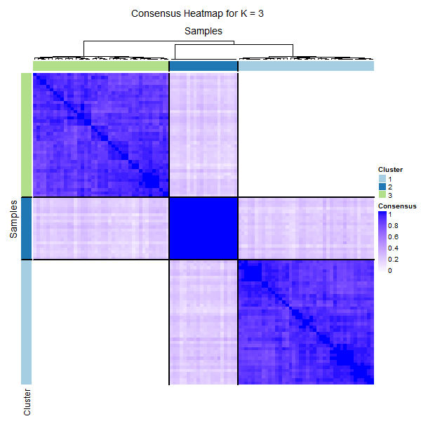 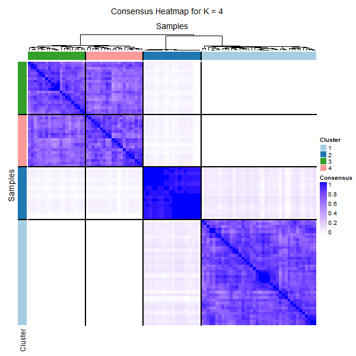
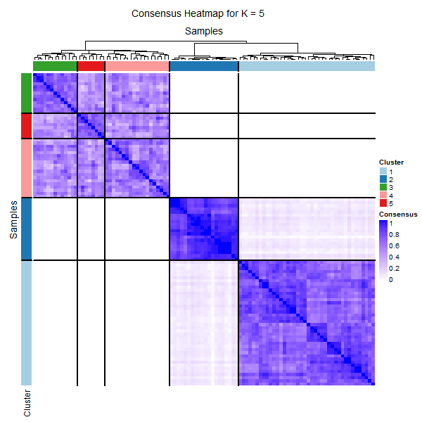 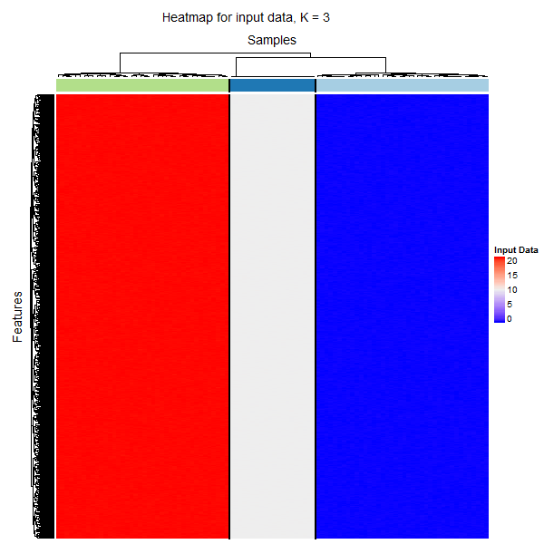
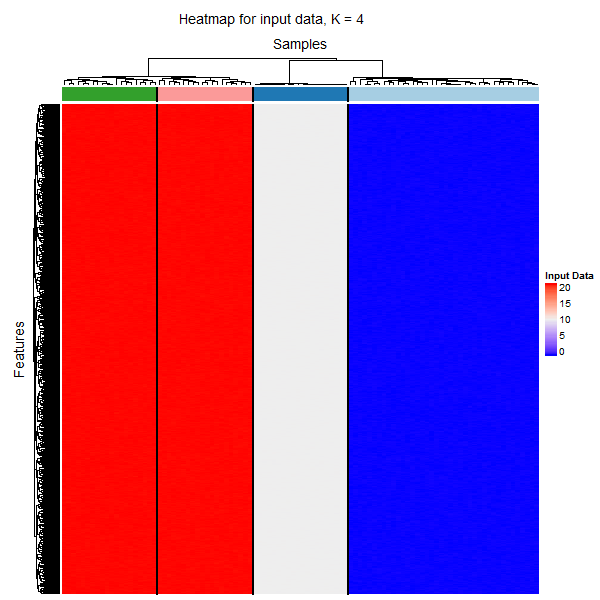 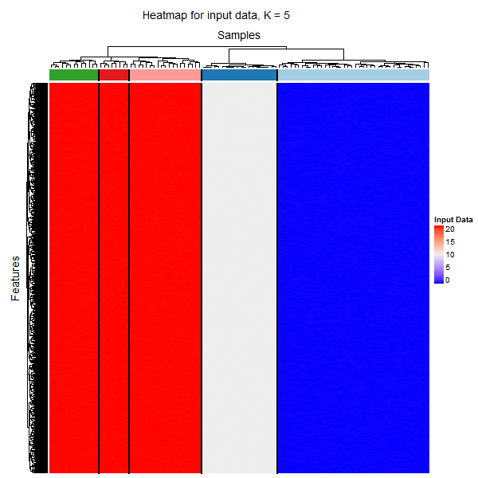

### Cumulative Distribution Function of Consensus Indexes, PAC scores and relative change in the area under CDF
The CDF plot shows the cumulative distribution functions of the consensus indexes for all pairs of samples for each k (indicated by colors). The empirical CDF plot holds the cumulative distribution function (CDF) values on the y and the consensus index values on the x-axis. In the CDF curve, the lower left portion represents sample pairs rarely clustered together, the upper right portion represents those almost always clustered together, whereas the middle portion represents those with occasional co-assignments in different clustering runs. Tthe CDF curves show a flat middle segment for the true K, suggesting that very few sample pairs are ambiguous when K is correctly inferred. 

The PAC score can be used to quantify this characteristic. The Proportion of Ambiguous Clustering (PAC) is the fraction of sample pairs that hold consensus index values within a given sub-interval (x1, x2) in [0,1] (usually, x1 = 0.1 and x2 = 0.9). The CDF values correspond to the fraction of sample pairs with a consensus index values less or equal to the value 'c'. The PAC is then calculated by CDF(x2) - CDF(x1), optimal K should present a low PAC score. 

The difference between the two CDFs can be partially summarized by measuring the area under the two curves. The plot of the relative change in the area under the CDF curve allows a user to determine the relative increase in consensus and determine the value of K at which there is no appreciable increase.

To see the PAC scores:

```{r}
results$PACscores
```

To plot the CDF plot and relative change plot outside of the main function simply call the following:

```{r, fig.show='hold', eval=FALSE}
PlotCDF(results)
```
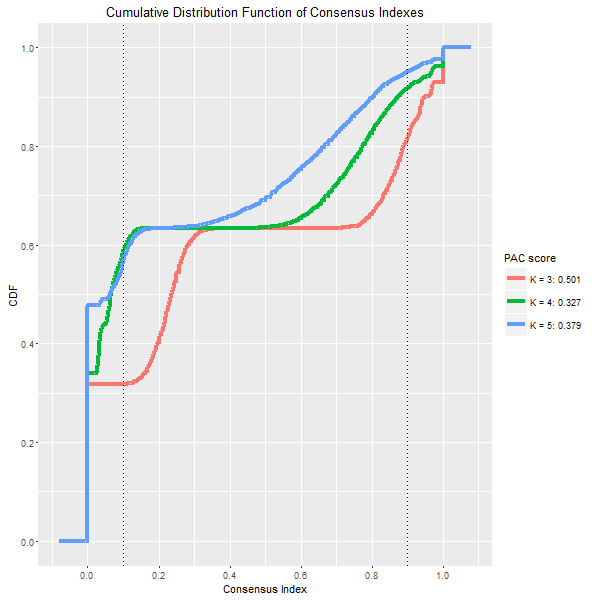 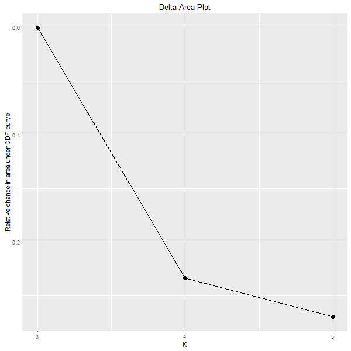

### Tracking Plot  
This graphic shows the cluster assignment of items (columns) for each k (rows). This plot provides a view of item cluster membership across different k and enables users to track  the history of clusters relative to earlier clusters. For items that change clusters often (changing colors within a column) are indicative of unstable membership and thus unstable/unreliable clusters where as items that do not frequently change colors shows a strong membership and stable cluster asssignment.

```{r, eval=F}
PlotTracking(results, showSamplesNames = F)
```
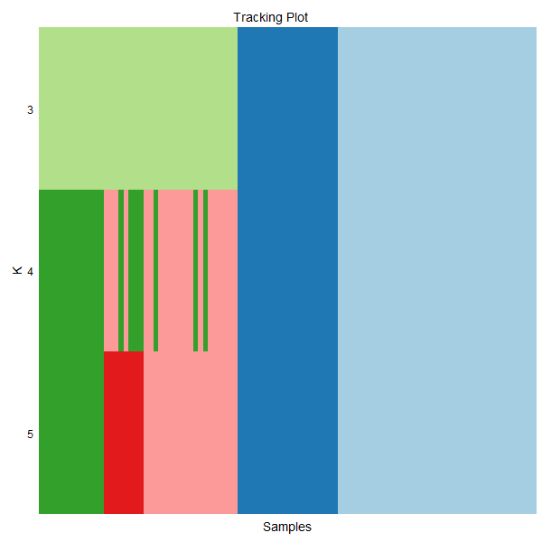

### Consensus Statistics and Plots

Our package outputs the following consensus statistics to asses the robustness of the clustering and the optimal values of K:

* Cluster Consensus: average consensus index between all pairs of items belonging to the same cluster, for each K.
* Item consensus: average consensus index between item i and all the (other) items in cluster cl, for all i and cl, for each K.
* Intra and Inter Cluster consensus: intra consensus statistic (the mean of all cluster consensus for each K) and inter consensus statistic (mean of all item consensus between an item and all clusters to which the item does not belong, for each K).

```{r}
results$consensusStats$clusterConsensus
head(results$consensusStats$itemConsensus)
results$consensusStats$intraInterCons
```

The following graphics tools can help to visualize those statistics.

* Cluster Consensus Plot: This plot highlights the mean pairwise consensus values between a cluster's members for each k. The color scheme follows all previous graphs and sample are stacked bars grouped by K value on the horizontal x-axis. High values show that the clusters hold high stability and likewise low values highlights a clusters instability. 
* Item Consensus Plot: Each stacked bar is a sample. Item-consensus values are indicated by the heights of the colored portion of the bars (using the tracking color scheme). This plot provides a view of item-consensus across all other clusters at a given k. As Wilkerman (2010) explains, with this plot it is possible to see if a sample is a very "pure" member of a cluster or if it shares high consensus to multiple clusters (large rectangles in a column of multiple colors), suggesting that it is an unstable member.

```{r, fig.show='hold',eval=F}
stats <- ConsensusStatsAndPlots(results)
```

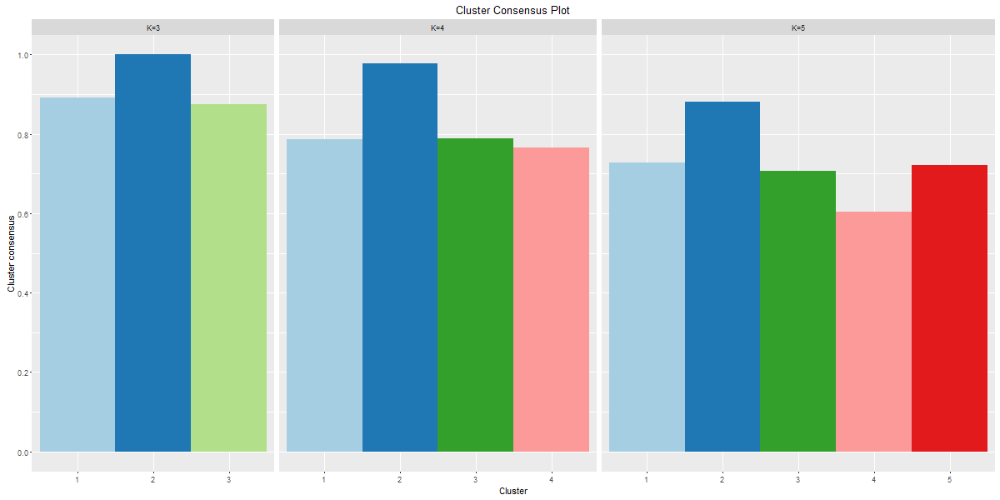
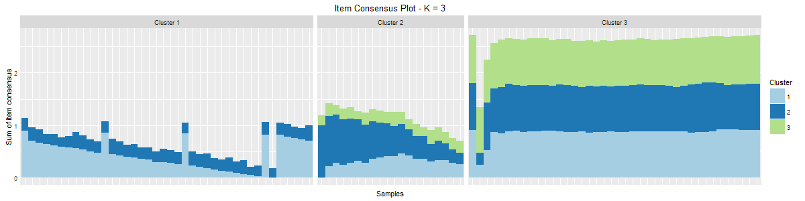
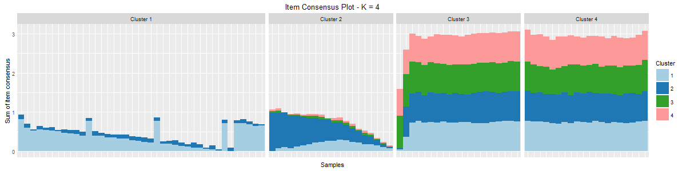
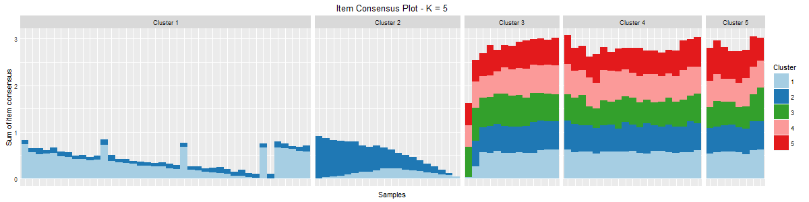


## References
Monti, S et al (2003) Consensus Clustering: A Resampling-Based Method for Class Discovery and Visualization of Gene Expression Microarray Data. Machine Learning, 52, 9118.  

Wilkerson M and Hayes D (2010) ConsensusClusterPlus: a class discovery tool with confidence assessments and item tracking. Bioinformatics, 26, 1571573.  

Senbabaoglu, Y et al (2014) Critical limitations of consensus clustering in class discovery. Scientific Reports, 4, Article number 6207.  
